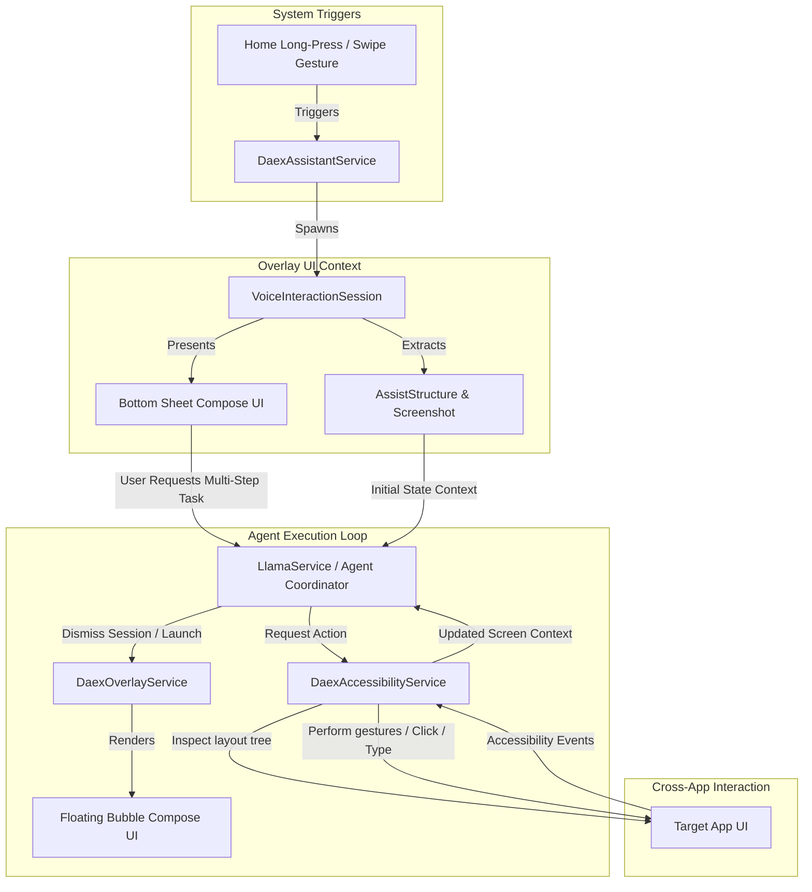

# Technical Design: On-Device Agent Architecture for Android

This document outlines the architectural blueprint for implementing a cross-app agent execution environment on Android. It describes how to combine background services, screen overlays (floating windows), native assistant sessions, and accessibility tools into a unified, on-device loop.

---

## 1. Architectural Overview

To enable the DAEX local model to act as an agent (reading screen context, planning actions, and clicking/typing in third-party apps), the system must coordinate multiple background and UI components:



---

## 2. Background Component Architecture

### A. Accessibility Bridge (`DaexAccessibilityService`)
The accessibility service is the hands and eyes of the agent. It runs continuously as a background process and is granted permission to inspect active window structures.

#### 1. Manifest Declaration (`AndroidManifest.xml`)
The service must be declared in the manifest, protected by the `BIND_ACCESSIBILITY_SERVICE` permission, and reference an XML configuration file:

```xml
<service
    android:name=".services.DaexAccessibilityService"
    android:permission="android.permission.BIND_ACCESSIBILITY_SERVICE"
    android:exported="false">
    <intent-filter>
        <action android:name="android.accessibilityservice.AccessibilityService" />
    </intent-filter>
    <meta-data
        android:name="android.accessibilityservice"
        android:resource="@xml/accessibility_service_config" />
</service>
```

#### 2. Configuration (`res/xml/accessibility_service_config.xml`)
This configures what events the service listens to and how it behaves. For a general agent, it should capture window changes and UI clicks:

```xml
<?xml version="1.0" encoding="utf-8"?>
<accessibility-service xmlns:android="http://schemas.android.com/apk/res/android"
    android:accessibilityEventTypes="typeWindowStateChanged|typeWindowContentChanged"
    android:accessibilityFeedbackType="feedbackGeneric"
    android:accessibilityFlags="flagDefault|flagRetrieveInteractiveWindows|flagIncludeNotImportantViews"
    android:canRetrieveWindowContent="true"
    android:canPerformGestures="true"
    android:notificationTimeout="100" />
```

#### 3. Service Skeleton Implementation
The service maintains a reference to the active window node hierarchy and implements methods to click or enter text:

```kotlin
package com.daex.android.services

import android.accessibilityservice.AccessibilityService
import android.view.accessibility.AccessibilityEvent
import android.view.accessibility.AccessibilityNodeInfo
import kotlinx.coroutines.flow.MutableStateFlow
import kotlinx.coroutines.flow.asStateFlow

class DaexAccessibilityService : AccessibilityService() {

    companion object {
        private var instance: DaexAccessibilityService? = null
        
        private val _isActive = MutableStateFlow(false)
        val isActive = _isActive.asStateFlow()

        fun getInstance(): DaexAccessibilityService? = instance
    }

    override fun onServiceConnected() {
        super.onServiceConnected()
        instance = this
        _isActive.value = true
    }

    override fun onAccessibilityEvent(event: AccessibilityEvent) {
        // Monitors active application UI updates
    }

    override fun onInterrupt() {
        _isActive.value = false
        instance = null
    }

    override fun onDestroy() {
        super.onDestroy()
        _isActive.value = false
        instance = null
    }

    // Agent Accessor APIs
    fun getActiveWindowNode(): AccessibilityNodeInfo? {
        return rootInActiveWindow
    }

    fun clickNode(nodeId: String): Boolean {
        val root = rootInActiveWindow ?: return false
        val nodes = root.findAccessibilityNodeInfosByViewId(nodeId)
        if (nodes.isNotEmpty()) {
            return nodes[0].performAction(AccessibilityNodeInfo.ACTION_CLICK)
        }
        return false
    }

    fun inputText(nodeId: String, text: String): Boolean {
        val root = rootInActiveWindow ?: return false
        val nodes = root.findAccessibilityNodeInfosByViewId(nodeId)
        if (nodes.isNotEmpty()) {
            val node = nodes[0]
            val arguments = android.os.Bundle().apply {
                putCharSequence(AccessibilityNodeInfo.ACTION_ARGUMENT_SET_TEXT_CHARSEQUENCE, text)
            }
            return node.performAction(AccessibilityNodeInfo.ACTION_SET_TEXT, arguments)
        }
        return false
    }
}
```

---

## 3. "Appear Over Screen" UI Integration

### A. The System Overlay Window (`DaexOverlayService`)
When an agent takes control of the device, it displays a persistent, floating "console bubble" or panel in the corner of the screen. This allows the user to see what the agent is thinking, view logs, or stop execution instantly.

#### 1. Manifest Permissions
```xml
<uses-permission android:name="android.permission.SYSTEM_ALERT_WINDOW" />
```

#### 2. Service Implementation with Jetpack Compose
This background service uses the system `WindowManager` to render a Compose UI directly onto the overlay layer:

```kotlin
package com.daex.android.services

import android.app.Service
import android.content.Context
import android.content.Intent
import android.graphics.PixelFormat
import android.os.IBinder
import android.view.Gravity
import android.view.WindowManager
import androidx.compose.ui.platform.ComposeView
import androidx.lifecycle.LifecycleService
import androidx.lifecycle.setViewTreeLifecycleOwner
import androidx.savedstate.setViewTreeSavedStateRegistryOwner

class DaexOverlayService : LifecycleService() {

    private lateinit var windowManager: WindowManager
    private var composeView: ComposeView? = null

    override fun onCreate() {
        super.onCreate()
        windowManager = getSystemService(Context.WINDOW_SERVICE) as WindowManager
    }

    override fun onStartCommand(intent: Intent?, flags: Int, startId: Int): Int {
        super.onStartCommand(intent, flags, startId)
        if (composeView == null) {
            showOverlay()
        }
        return START_NOT_STICKY
    }

    private fun showOverlay() {
        val params = WindowManager.LayoutParams(
            WindowManager.LayoutParams.WRAP_CONTENT,
            WindowManager.LayoutParams.WRAP_CONTENT,
            WindowManager.LayoutParams.TYPE_APPLICATION_OVERLAY,
            WindowManager.LayoutParams.FLAG_NOT_FOCUSABLE or WindowManager.LayoutParams.FLAG_LAYOUT_IN_SCREEN,
            PixelFormat.TRANSLUCENT
        ).apply {
            gravity = Gravity.TOP or Gravity.START
            x = 100
            y = 100
        }

        composeView = ComposeView(this).apply {
            // Tie lifecycle owners to support compose state changes inside service
            setViewTreeLifecycleOwner(this@DaexOverlayService)
            setViewTreeSavedStateRegistryOwner(this@DaexOverlayService)
            
            setContent {
                // Render your premium monospaced console floating bubble here
                AgentOverlayBubble(
                    onClose = { stopSelf() },
                    onStopAgent = { /* Signal model execution stop */ }
                )
            }
        }

        windowManager.addView(composeView, params)
    }

    override fun onDestroy() {
        super.onDestroy()
        composeView?.let {
            windowManager.removeView(it)
            composeView = null
        }
    }

    override fun onBind(intent: Intent): IBinder? {
        super.onBind(intent)
        return null
    }
}
```

---

### B. The Native Assistant Overlay (`VoiceInteractionSession`)
This provides the Siri/Gemini slide-up bottom sheet trigger when the app is invoked as the default device assistant.

#### 1. Manifest Configuration
```xml
<service
    android:name=".services.DaexAssistantService"
    android:permission="android.permission.BIND_VOICE_INTERACTION"
    android:exported="true">
    <meta-data
        android:name="android.voice_interaction"
        android:resource="@xml/assistant_config" />
    <intent-filter>
        <action android:name="android.service.voice.VoiceInteractionService" />
    </intent-filter>
</service>
```

#### 2. Config Resource (`res/xml/assistant_config.xml`)
```xml
<?xml version="1.0" encoding="utf-8"?>
<voice-interaction-service xmlns:android="http://schemas.android.com/apk/res/android"
    android:sessionService="com.daex.android.services.DaexSessionService"
    android:recognitionService="com.daex.android.services.DaexRecognitionService"
    android:supportsAssist="true"
    android:supportsLocalInteraction="true" />
```

#### 3. Session Implementation (`VoiceInteractionSession`)
This runs when triggered, automatically gathering the foreground screen screenshot and layout structures:

```kotlin
package com.daex.android.services

import android.content.Context
import android.os.Bundle
import android.service.voice.VoiceInteractionSession
import android.view.View
import androidx.compose.ui.platform.ComposeView

class DaexSession(context: Context) : VoiceInteractionSession(context) {

    override fun onCreate() {
        super.onCreate()
    }

    override fun onCreateContentView(): View {
        return ComposeView(context).apply {
            setContent {
                // Bottom sheet Compose view for initial input
                AssistantBottomSheet(
                    onSubmit = { prompt ->
                        // Pass prompt to agent loop and trigger overlay
                        startAgentLoop(prompt)
                    }
                )
            }
        }
    }

    override fun onHandleAssist(
        assistState: AssistState
    ) {
        super.onHandleAssist(assistState)
        val structure = assistState.assistStructure // The foreground app node hierarchy
        val screenshot = assistState.assistScreenshot // The foreground app screenshot bitmap
        
        // Feed these to the LlamaService agent coordinator
        AgentStateBridge.updateInitialContext(structure, screenshot)
    }

    private fun startAgentLoop(prompt: String) {
        // Start the DaexOverlayService to render the floating console bubble
        val intent = Intent(context, DaexOverlayService::class.java)
        context.startService(intent)
        
        // Close the assistant bottom sheet session
        hide()
    }
}
```

---

## 4. Shared State & Agent Execution Loop Lifecycle

To allow the local LiteRT-LM model to execute actions, we orchestrate all elements via a central coordinator:

```
[ User prompt + Assist context -> AgentStateBridge ]
                      │
                      ▼
        [ Run LlamaService Inference ]
                      │
                      ▼ (Model outputs Tool Call)
   <|tool_call|>clickNode{"id": "search_button"}<|tool_call|>
                      │
                      ▼ (JNI Tool interceptor maps to DeviceTools)
             [ DeviceTools.clickNode ]
                      │
                      ▼ (Invokes Accessibility Service instance)
     [ DaexAccessibilityService.clickNode() ]
                      │
                      ▼ (Simulates click event on screen)
       [ Target App updates foreground UI ]
                      │
                      ▼
        [ Next loop: readScreenContext() ]
```

### Coordinator Data Bridges
Use Kotlin `SharedFlow` and `StateFlow` to synchronize status across processes:
1. **`AgentStateBridge`**: Holds the current execution step, thinking logs, and control signals (Pause/Stop/Cancel).
2. **`DeviceTools`**: Receives tool calls from `LlamaService`, verifies that `DaexAccessibilityService.getInstance()` is active, and delegates layout reads and gesture writes to it.
3. **`DaexOverlayService`**: Collects logs from `AgentStateBridge` and updates the floating UI bubble so the user has immediate visual confirmation of the agent's actions.
