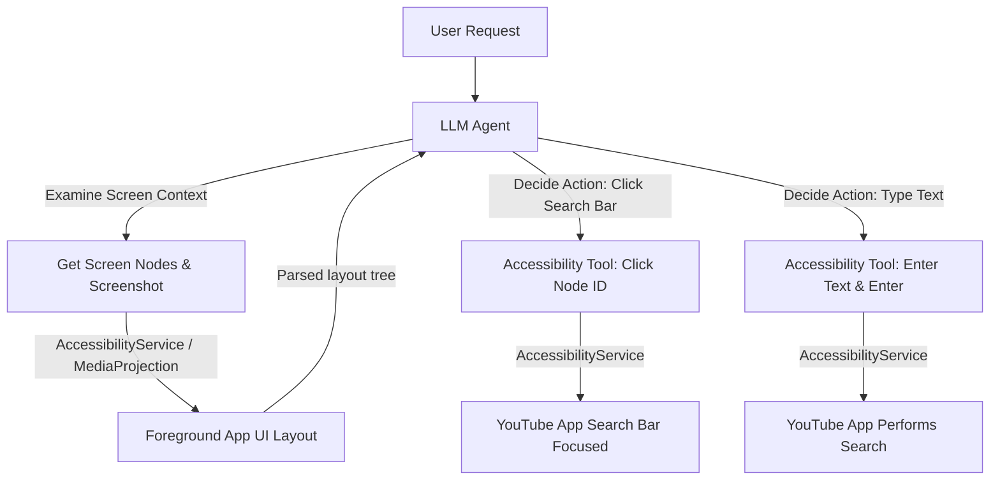

# Android Tool Capabilities & Integration Guide

This document outlines the range of system features, hardware APIs, and integration patterns that can be exposed as native tools to the DAEX on-device LLM. It includes direct analysis of how DAEX can retrieve screen context and execute actions inside other applications.

---

## 1. Deep Dive: Cross-App Actions & Screen Context

To interact with other apps or understand what is currently on the screen, Android provides several powerful APIs. These can be wrapped as tools for the model.

### A. Screen Context & Action Execution via Accessibility Services (`AccessibilityService`)
* **How it works**: By registering an `AccessibilityService`, DAEX obtains system-wide permissions to monitor user interactions and inspect screen contents.
* **Capabilities**:
  * **Screen Context (Reading)**: Accesses the layout node hierarchy (`AccessibilityNodeInfo`) of the active foreground application. The model can inspect text, descriptions, button labels, and input fields.
  * **Actions (Writing)**: Emulates user gestures. The service can programmatically call `performAction(AccessibilityNodeInfo.ACTION_CLICK)`, `ACTION_SCROLL_FORWARD`, or enter text using `ACTION_SET_TEXT`. It can also trigger global gestures (Home, Back, Recents).
* **Viability for DAEX**: **High (for automation)**. This is the only way to perform actions inside closed third-party apps that do not expose public APIs. 
* **User Permission**: Requires the user to explicitly enable the service in Android's system settings under *Accessibility*.

### B. Visual Screen Context via Media Projection (`MediaProjection`)
* **How it works**: Captures the device's display buffer.
* **Capabilities**:
  * **Visual Feedback**: Generates real-time screenshots or frames of the screen.
  * **Multimodal Integration**: Feed screenshot bitmaps directly to a visual LLM (such as Gemma 3 Vision) to perform OCR, locate UI elements, and decide on screen coordinates.
* **User Permission**: Requires runtime approval via a system-level popup every time the projection session starts.

### C. System Assistant Integration (`VoiceInteractionService` / Assist API)
* **How it works**: By registering DAEX as the default digital assistant application on the device.
* **Capabilities**:
  * **Immediate Context**: When long-pressing the power button or saying a wake-word, the OS automatically provides the app with `AssistStructure` (the layout tree of the active app) and `AssistScreenshot` (a screenshot of the active app) without requiring background Accessibility permissions.
* **Viability for DAEX**: **High (for context-aware querying)**. This is the native Android way for assistant apps to know what the user is looking at.

### D. Inter-Process Communication via Intents & Deep Links
* **How it works**: Triggering explicit or implicit intent structures.
* **Capabilities**:
  * **Targeted Actions**: Send data directly to other apps (e.g., launching Spotify to search and play a song, opening Google Maps to navigate to coordinates, composing an email draft in Gmail, opening a specific setting panel).
* **Viability for DAEX**: **High (for routing)**. Extremely stable and does not require accessibility permissions, but relies on target apps supporting standard Intent filters.

---

## 2. Categorized Android Native Tools List

Below is a list of other native Android tools that can be exposed to the DAEX model.

### Category 1: Communication & Messaging
| Tool Name | Android API / Component | Description |
| :--- | :--- | :--- |
| `sendSMS` | `SmsManager` | Send background SMS text messages to a phone number. |
| `readSMS` | `Telephony.Sms` Content Provider | Retrieve incoming SMS messages or search message threads. |
| `initiateCall` | `Intent.ACTION_CALL` or `ACTION_DIAL` | Place direct calls or open the dialer with a prefilled number. |
| `notificationReply` | `NotificationListenerService` | Read active notifications from other apps (e.g., WhatsApp, Discord) and send replies directly by invoking `RemoteInput` pending intents. |

### Category 2: Personal Information Management (PIM)
| Tool Name | Android API / Component | Description |
| :--- | :--- | :--- |
| `getContacts` | `ContactsContract` | Search, retrieve, or add contacts from the device phonebook. |
| `manageCalendar` | `CalendarContract` | Query calendar events, insert new meetings, or edit existing schedule entries. |
| `getAlarms` | `AlarmManager` | List set alarms or configure new one-time/recurring timers. |

### Category 3: System Controls & Hardware Settings
| Tool Name | Android API / Component | Description |
| :--- | :--- | :--- |
| `toggleWifi` | `WifiManager` | Turn Wi-Fi on or off (API restrictions apply on newer Android versions). |
| `toggleBluetooth`| `BluetoothAdapter` | Enable/disable Bluetooth or list paired bluetooth accessories. |
| `adjustVolume` | `AudioManager` | Control ringtone, media, alarm, and system volume levels. |
| `adjustBrightness`| `Settings.System` | Query or change screen brightness levels. |
| `toggleFlashlight`| `CameraManager` | Turn the device's camera flash LED on or off. |

### Category 4: Media & File Management
| Tool Name | Android API / Component | Description |
| :--- | :--- | :--- |
| `searchMedia` | `MediaStore` | Locate photos, videos, or audio files on local storage by metadata, date, or location. |
| `playbackControl`| `MediaSessionManager` / `Intent.ACTION_MEDIA_BUTTON` | Pause, resume, skip, or rewind active media sessions (Spotify, YouTube, etc.). |
| `readLocalFile` | `Storage Access Framework` / `File` | Read contents of authorized files (PDFs, text files, logs) for ingestion. |

### Category 5: Sensors & Environment Context
| Tool Name | Android API / Component | Description |
| :--- | :--- | :--- |
| `getLocation` | `FusedLocationProviderClient` (GPS) | Retrieve current latitude, longitude, altitude, and bearing. |
| `getStepCount` | `Sensor.TYPE_STEP_COUNTER` | Get daily steps from hardware step counters. |
| `getSensorData` | `SensorManager` | Query ambient light levels, temperature, barometric pressure (if hardware available). |

---

## 3. Implementation Blueprint for Cross-App Control

If DAEX aims to act *within* other apps (e.g. "open YouTube and search for Lo-Fi music"), the system architecture should be structured as follows:

### Safety & UX Guidelines
1. **User Approval**: Accessibility tools that write data (clicks, entering text) should prompt the user for validation (e.g., "Confirm click on 'Send Payment'?") to prevent adversarial LLM behavior.
2. **Rate Limiting**: Emulate human-like delays between gestures to prevent target apps from crashing or detecting bots.
3. **Graceful Fallbacks**: If Accessibility is not enabled, fall back to implicit Intents (e.g., `Intent.ACTION_VIEW` with a `https://youtube.com/results?search_query=...` URI).
